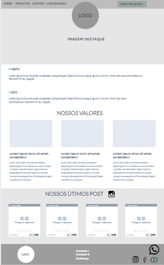
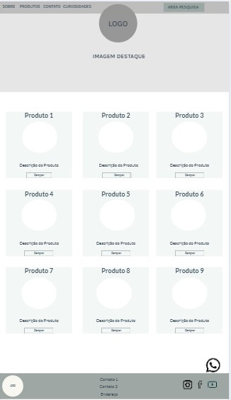
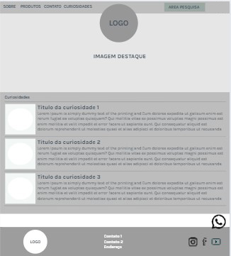

# Projeto de Interface

Estamos estabelecendo foco em questões como acessibilidade, agilidade e usabilidade. O projeto tem identidade visual padronizada (menu e footer) em todas as telas e todas as telas são projetadas para funcionamento em desktops e dispositivos móveis (Modelo Ipad e Iphone X).

Importante destacar que  o projeto foi elaborado de forma a atender os requisitos funcionais, não funcionais e histórias de usuário abordados nas <a href="https://github.com/ICEI-PUC-Minas-PMV-ADS/Pequenos-Negocios/blob/main/docs/02-Especifica%C3%A7%C3%A3o%20do%20Projeto.md"> Documentação de Especificação</a>.

## Fluxo do Usuário

O diagrama abaixo apresenta o fluxo de interação do usuário pelas telas do sistema. Cada uma das telas desse fluxo é detalhada na secão do Wireframe no próximo tópico.
Para visualizar o wireframe interativo, acesse o <a href="https://marvelapp.com/prototype/615ej48"> MarvelApp do projeto</a>.

# Wireframes

# Cabeçalho e Rodapé

A barra superior do Menu e o footer apresentam os mesmos elementos em todas as páginas.
O footer direciona para a página de contato / formulário.
Na página formulário, o footer direcionará para a Home Page.

## Tela Home Page

A tela inicial da página - o cartão de visita - primeiramente apresenta uma seção com cards de conteúdo convidativo aos produtos.
Seção com vídeos feitos pelas microeemprededoras na plataforma de vídeos YouTube, e seção com depoimentos de clientes.

## Tela Sobre

A tela sobre apreresenta a missão, visão e valores da empresa.
O carrossel com as últimas postagens que será linkado com o Instagram.

## Tela Produtos

A tela produtos apresenta os itens disponíveis para fabricação, dividido em cards com fotos, descrição e preço dos produtos.

## Tela Contato / Formulário

A tela contato apresenta os dados de contato e possibilita o envio de mensagem via formulário.
Apresentamos também informações sobre a localização através de um mapa.

## Tela Curiosidades

A tela curiosidades trás informações sobre o mundo da culinária com o objetivo de motivar os possíveis clientes visitarem o site.
A seção curiosidades apresenta 3 curiosodades sobre culinária, e o conteúdo é dividido entre imagem e texto.

## Tela Carrinho

A tela carrinho agrupa os itens selecionados na página produtos totalizando o pedido do cliente com a possibilidade de envia-lo via Whatsapp.
Existe a possibilidade de alteração das quantidades e remoção de itens.

