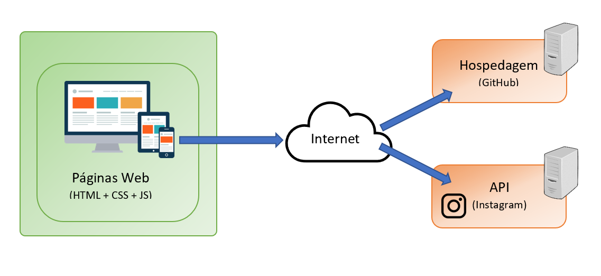

# Arquitetura da Solução

Nesta seção são apresentamos os detalhes técnicos da solução criada pela equipe, tratando dos componentes que fazem parte da solução e do ambiente de hospedagem da solução.

## Diagrama de componentes

Os componentes que fazem parte da solução são apresentados na Figura conforme abaixo:

A solução implementada conta com os seguintes módulos:
- **Navegador** - Interface básica do sistema  
 - **Páginas Web** - Conjunto de arquivos HTML, CSS, JavaScript e imagens que implementam as funcionalidades do sistema.
 - **API Instagram** - plataforma exibe as últimas postagens do Instagram.
 - **Hospedagem** - local na Internet onde as páginas são mantidas e acessadas pelo navegador. 

## Hospedagem

O site utiliza a plataforma do Replit como ambiente de hospedagem do site do projeto. 
O site é mantido no ambiente da URL: 

https://pequenos-negocios.ricardoteixeir6.repl.co/home.html

A publicação do site no GitHub é feita por meio de uma submissão do projeto (push) via git 
para o repositório remoto que se encontra no endereço: 

https://github.com/ICEI-PUC-Minas-PMV-ADS/Pequenos-Negocios.git
