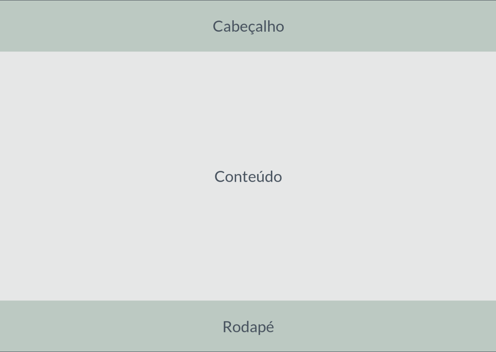

# Template padrão do site

O padrão de layout a ser utilizado pelo site tem correspondência ao projeto de Interface elaborado anteriormente, conforme a figura abaixo:

O template criado é composto pelo seguinte layout: 

⦁	Tela principal

A responsividade segue o padrão do Bootstrap

Tela Principal
Tela que abrange todas as visualizações iniciais do site e a lista de notícias gerais.
