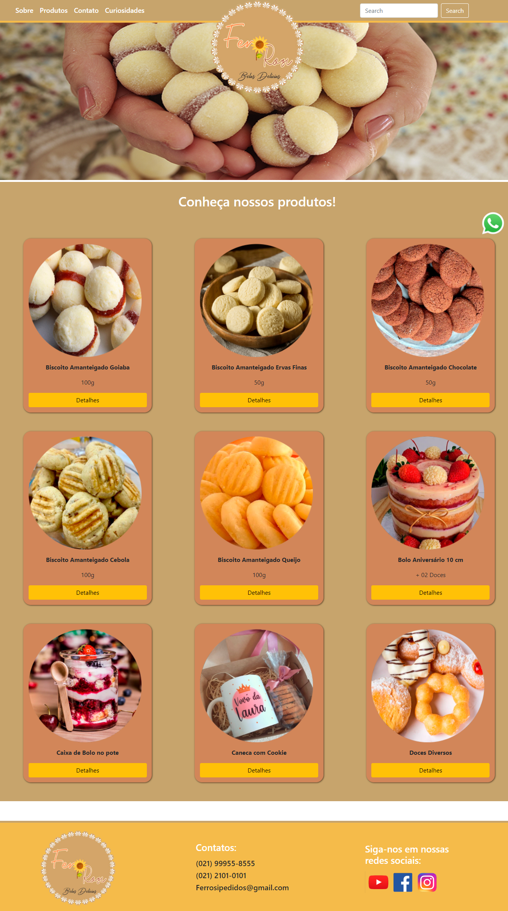
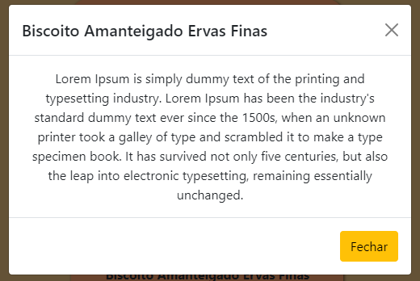
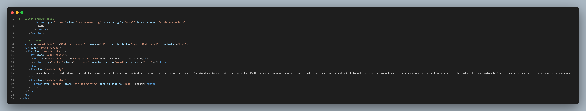
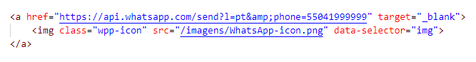

# Programação de Funcionalidades

Nesta seção são apresentadas as telas desenvolvidas para cada uma das funcionalidades do sistema. O respectivo endereço (URL) e outras orientações de acesso são apresentadas na sequência.

## Tela de produtos (RNF-002)
A tela de produtos apresenta a funcionalidade com todas as informações dos produtos oferecidos, contendo fotos e demais detalhes sobre os mesmos. Confira na figura abaixo:

**Requisitos atendidos**
- RNF-002 - O site deve conter uma sessão “Produtos” que contenha informações, fotos, valores e demais detalhes sobre os produtos/serviços

**Artefatos da funcionalidade**
- Produtos.html
-	style.css
-	Produto1.jpeg
-	Produto2.jpeg
-	Produto3.jpeg
-	Produto4.jpeg
-	Produto5.jpeg
-	Produto6.jpeg
-	Produto7.jpeg
-	Produto8.jpeg

**Estrutura de Dados**

**Instruções de acesso**
1. Abra um navegador de Internet e informe a seguinte URL: https://ferrosi-belas-delicias.gabrielsouza56.repl.co/Produtos.html
2. A funcionalidade da sessão Produtos se encontra no segundo item do menu no cabeçalho da página.

## Modal de detalhes dos produtos (RNF-009)
O Cabeçalho do site apresenta a funcionalidade de buscar informações. Um exemplo da tela é apresentada na Figura abaixo:

**Requisitos atendidos**
- RNF-002 - O site deve O site deve conter uma sessão “Produtos” que contenha informações, fotos, valores e demais detalhes sobre os produtos/serviços.

**Artefatos da funcionalidade**
- produtos.html
-	style.css

**Estrutura de Dados**

**Instruções de acesso**
1. Abra um navegador de Internet e informe a seguinte URL: [https://ferrosi-belas-delicias.gabrielsouza56.repl.co/Produtos.html]
2. O Modal de detalhes está no botão "Detalhes" localizado nos cards dos produtos.

## Botão estático de WhatsApp (RNF-012)
O site apresenta a funcionalidade de um botão estático para enviar mensagens pelo WhatsApp. Um exemplo da tela é apresentada na Figura abaixo: 

**Requisitos atendidos**
- RNF-012 - O site deve apresentar botão estático de whatsapp em todas as páginas

**Artefatos da funcionalidade**
- home.html
-	style.css
-	WhatsApp-icon.png

**Estrutura de Dados**

**Instruções de acesso**
1. Abra um navegador de Internet e informe a seguinte URL: [https://ferrosi-belas-delicias.gabrielsouza56.repl.co/index.html]
2. A funcionalidade do botão do WhatsApp sempre aparece no canto inferior-direito da página
