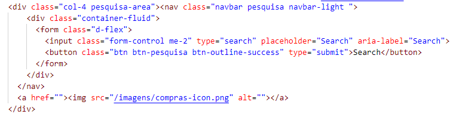

# Programação de Funcionalidades

Nesta seção são apresentadas as telas desenvolvidas para cada uma das funcionalidades do sistema. O respectivo endereço (URL) e outras orientações de acesso são apresentadas na sequência.

## Busca de informações (RNF-009)
O Cabeçalho do site apresenta a funcionalidade de buscar informações. Um exemplo da tela é apresentada na Figura abaixo. 

**Requisitos atendidos**
- RNF-009 - O site deve conter o campo de busca

**Artefatos da funcionalidade**
- home.html
-	style.css
-	form.d-flex

**Estrutura de Dados**

**Instruções de acesso**
1. Abra um navegador de Internet e informe a seguinte URL: [colocar url]
2. A funcionalidade de busca está no cabeçalho do lado direito 

## Botão estático de WhatsApp (RNF-012)
O site apresenta a funcionalidade de um botão estático para enviar mensagens pelo WhatsApp. Um exemplo da tela é apresentada na Figura abaixo. 

**Requisitos atendidos**
- RNF-012 - O site deve apresentar botão estático de whatsapp em todas as páginas

**Artefatos da funcionalidade**
- home.html
-	style.css
-	WhatsApp-icon.png

**Estrutura de Dados**

**Instruções de acesso**
1. Abra um navegador de Internet e informe a seguinte URL: [colocar url]
2. A funcionalidade do botão do WhatsApp sempre aparece no canto inferior-direito da página
